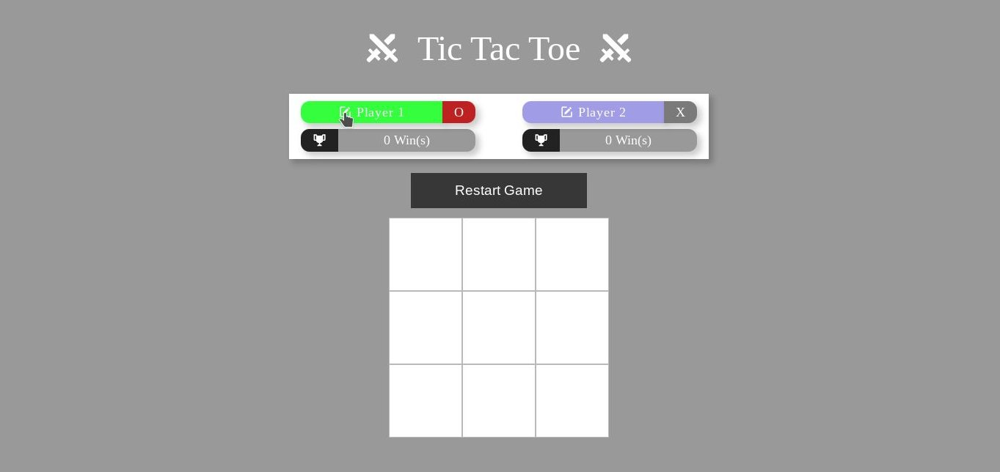

# Tic Tac Toe

A simple tic-tac-toe game with two human players

## Name Highlighting

The current player's name is highlighted:

  

## Editing Player Name

You can edit the current's player name:

## Result Dialog

Whether either player wins or draws, a modal dialog will be displayed declaring the result. The name of the winner will be displayed if the result is a win:

